# AutoScalingGroup + Application Load Balencer Lab
This is my second lab in my Exam. Ask you to create Auto Scaling Group + Application Load Balencer + Target Group on your own.

### Prepare
Create your own VPC for simulate the Lab. You can create a new VPC with new feature by one click or do it the old way.

### Start the Lab

#### There are three requirements:

- Create 2 Security group
    - First Security Group for ALB which only allow inbound on port 80
    - Second Security Group for ASG which only allow traffic from ALB on port 80
- Create ALB
    - Internet facing
    - Security Group only allow inbound on port 80
    - Target Group with:
        - 
        -  Health check path: index.html
- Create ASG with
    - launch configuration:
        - Instance type: t3.nano
        - Security Group : Only allow traffic from ALB
        - User Data
            ```
            yum update -y
            amazon-linux-extras install -y lamp-mariadb10.2-php7.2 php7.2
            yum install -y httpd mariadb-server
            systemctl start httpd
            systemctl enable httpd
            usermod -a -G apache ec2-user
            chown -R ec2-user:apache /var/www
            chmod 2775 /var/www
            find /var/www -type d -exec chmod 2775 {} \;
            find /var/www -type f -exec chmod 0664 {} \;
            echo "<?php phpinfo(); ?>" > /var/www/html/phpinfo.php
            ```
    - Group Size:
        - Minimum and Desired Capacity: 2
        - Maximum Capacity : 4
    - Create Target Tracking Policy with:
        - Average CPU ultilization : 75 

<b>First requirement:</b>

1. Open the Amazon EC2 console at https://console.aws.amazon.com/ec2/.

2. In the navigation pane, choose Security Groups.

3. Choose Create security group.

4. Create first security group on allow traffic from internet(Source: Anywhere) on port 80

<p align="center">
  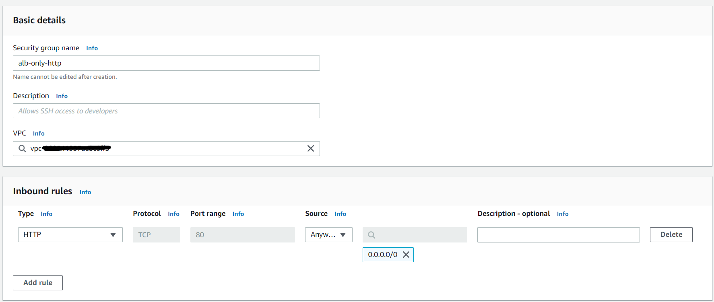
</p>

4. Create second security group on allow traffic from alb(Source: alb's security group) on port 80

<p align="center">
  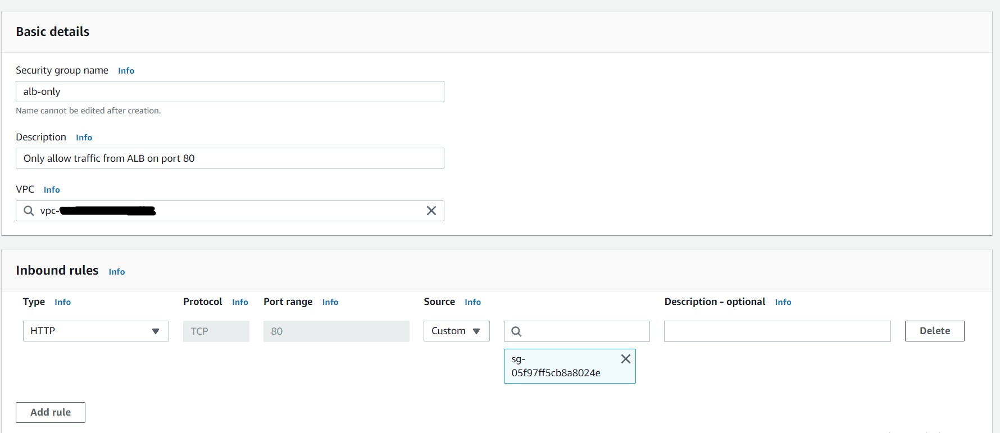
</p>

<b>Second requirement:</b>

1. Open the Amazon EC2 console at https://console.aws.amazon.com/ec2/.

2. In the left navigation pane, under Load Balancing, choose Target Groups.

3. Choose Create target group.

4. In the Basic configuration section, select Instance to specify targets by instance ID and enter a name for the target group.

<p align="center">
  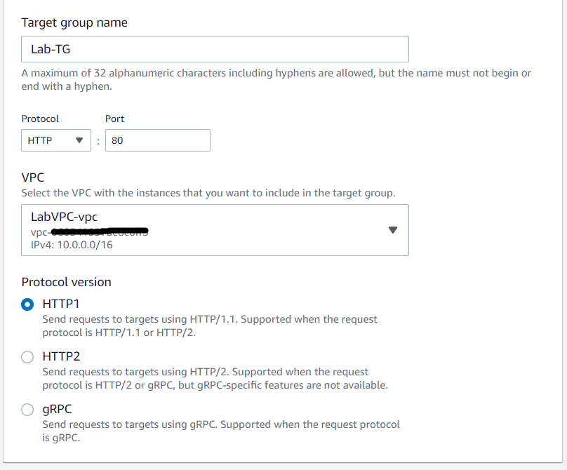
</p>

5. Choose your VPC for simulate the Lab

6. In the Health checks section, set the Health check to the target group with HTTP protocol and set the path to /index.php

<p align="center">
  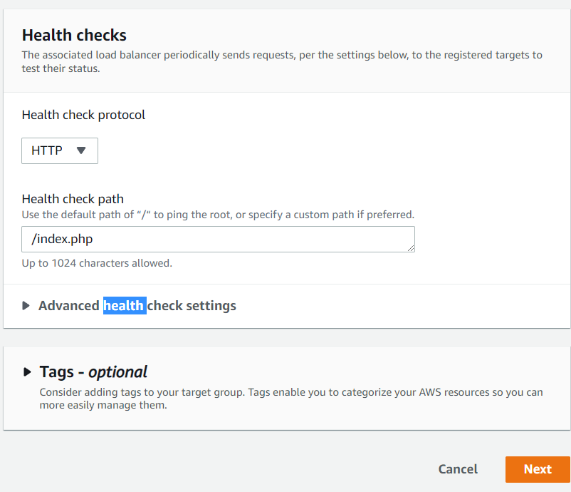
</p>

6. In the navigation pane, under Load Balancing, choose Load Balancers. Choose Application Load Balancer

7. For Load balancer name, enter a name for your load balancer.For Scheme, choose Internet-facing

<p align="center">
  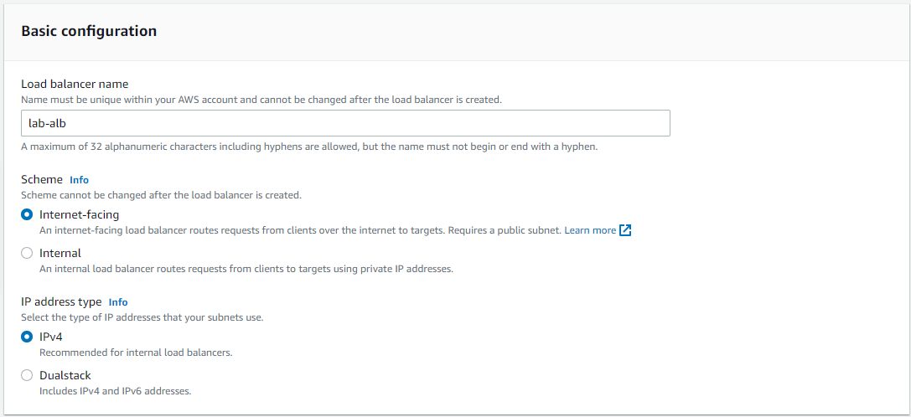
</p>

8. For VPC, select the VPC that you used for your EC2 instances. If you selected Internet-facing for Scheme, only VPCs with an internet gateway are available for selection. For Mappings, select two or more Availability Zones and corresponding subnets

<p align="center">
  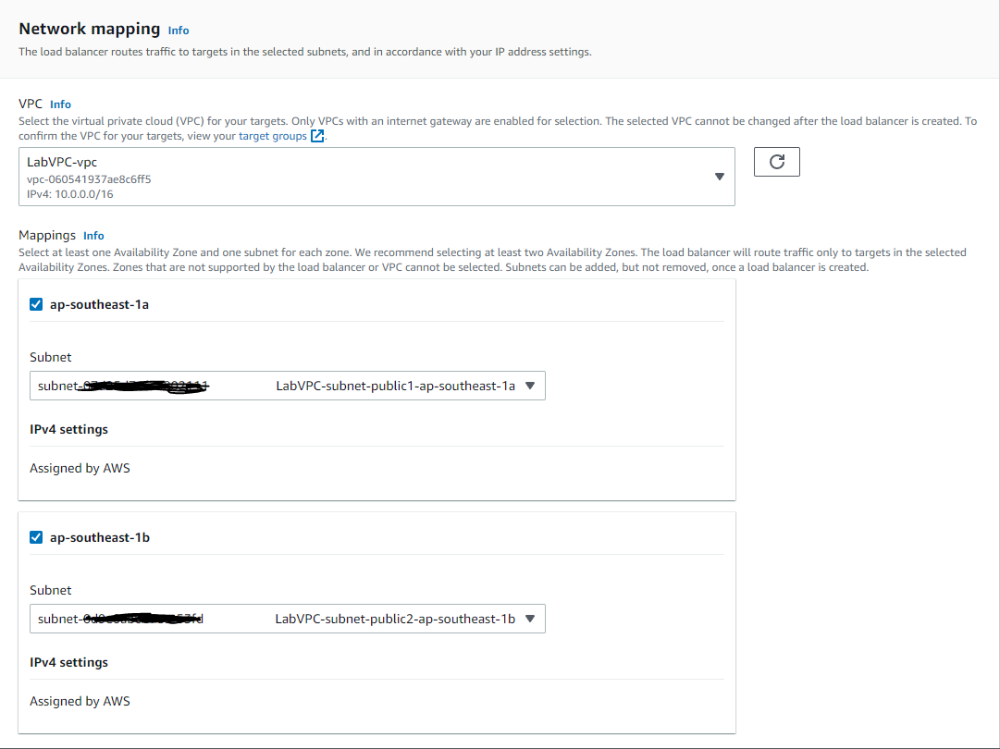
</p>

9. For Security groups, select an existing security group. For Listeners and routing, the default listener accepts HTTP traffic on port 80 and forward to existed Target group that you create before

<p align="center">
  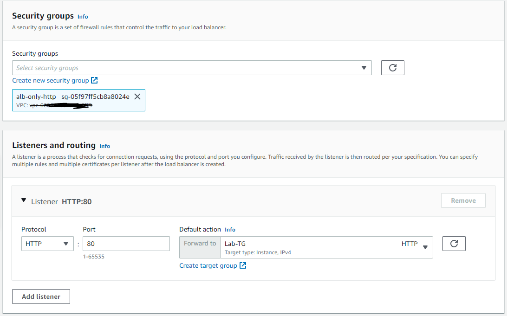
</p>

<b>Third requirement:</b>

1. To create a launch configuration. On the navigation pane, under AUTO SCALING, choose Launch Configurations.

2. Choose Create launch configuration, and enter a name for your launch configuration.

3. For Amazon machine image (AMI) , choose an AMI (The AMI will be specify in the lab, sine i dont remeber it's AMI number so i will pick random). And choose Instance type: t3.micro

<p align="center">
  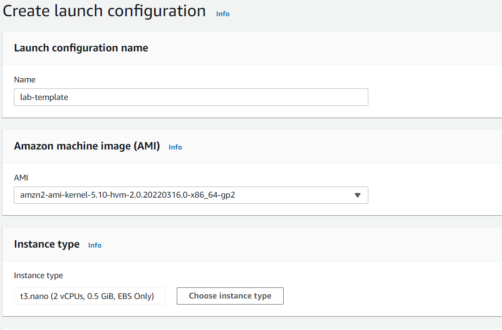
</p>

4. For Advanced details, specify User Data to configure an instance during launch
<p align="center">
  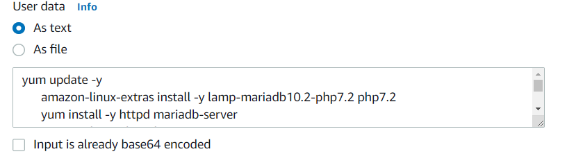
</p>

5. For Security groups, select existed security group which only allow traffic from ALB

<p align="center">
  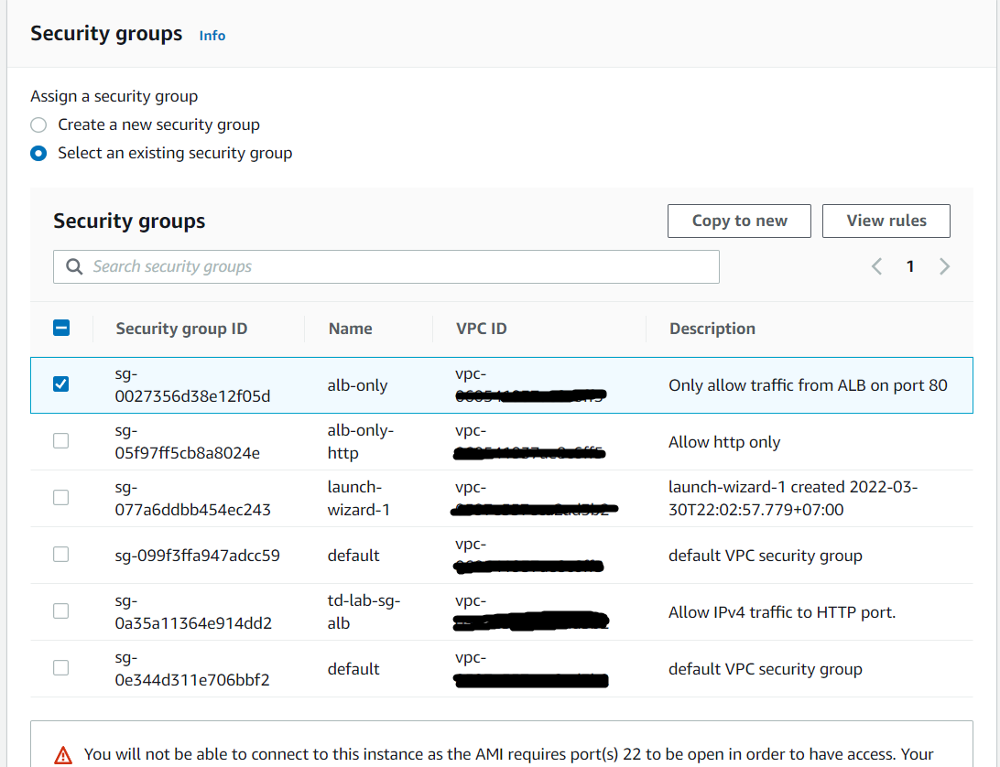
</p>

6. On the navigation pane, under AUTO SCALING, choose  Auto Scaling group. 

7. On the Choose launch template and select the template that you just create, for Auto Scaling group name, enter a name for your Auto Scaling group.

<p align="center">
  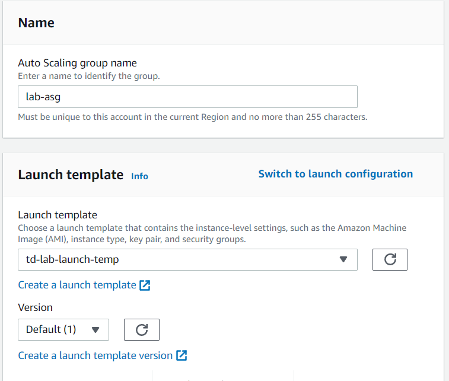
</p>

8. On the Configure instance launch options page, under Network, for VPC, choose a VPC. The Auto Scaling group must be created in the same VPC as the security group you specified in your launch configuration. For Availability Zones and subnets, choose one or more subnets in the specified VPC

<p align="center">
  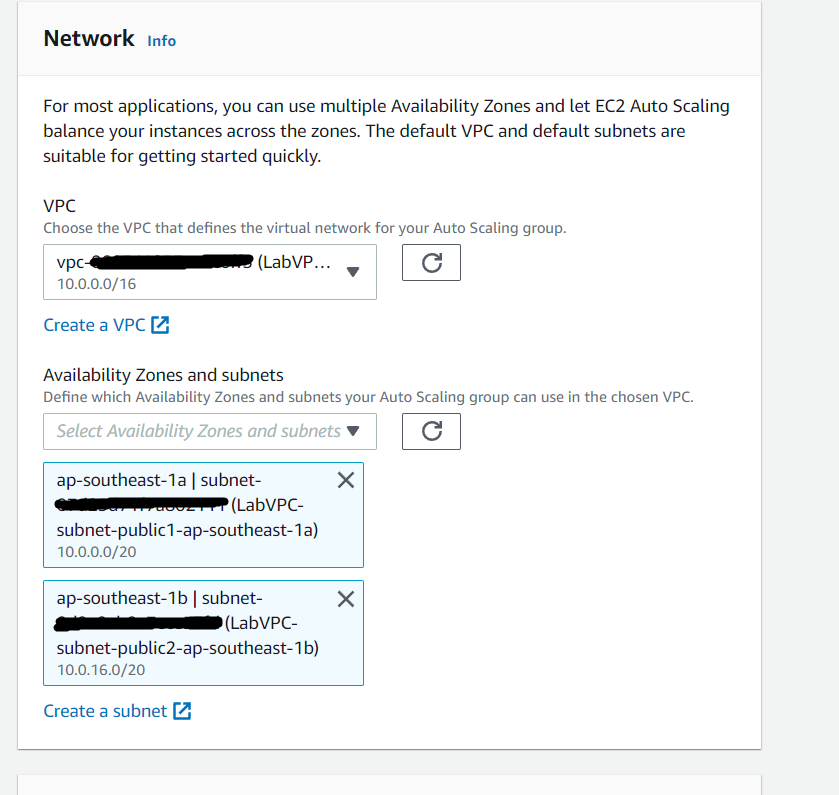
</p>

9. To register your Amazon EC2 instances with a load balancer, choose an existing load balancer 

<p align="center">
  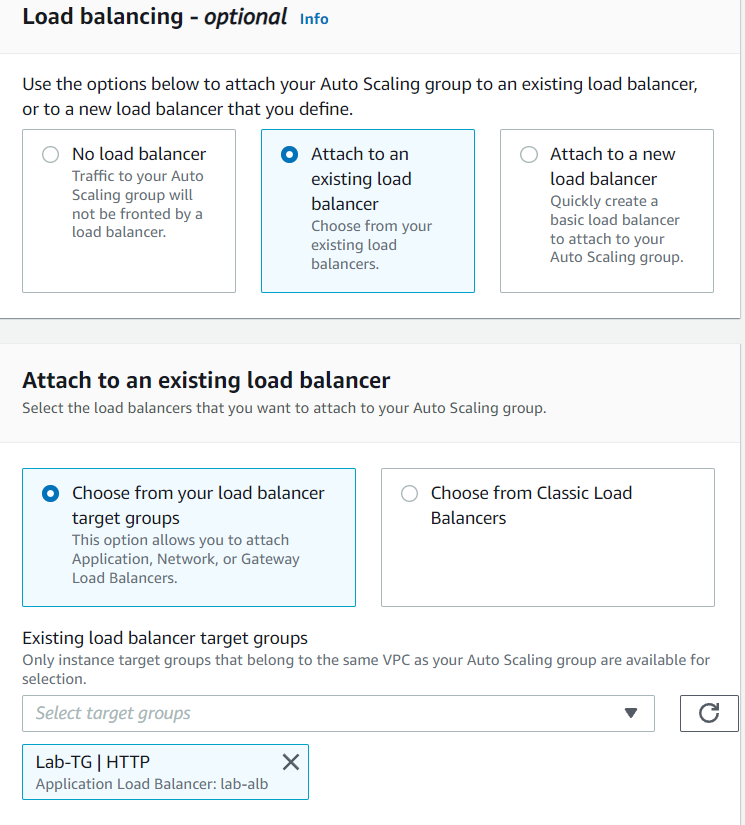
</p>

10. On the Configure group size and scaling policies page, configure the following options:
    - Desired capacity: 2 
    - Minimum capacity: 2
    - Maximum capacity: 4

<p align="center">
  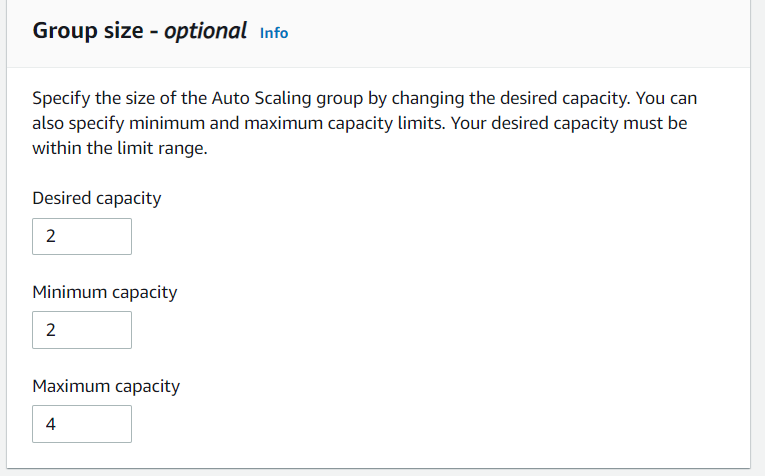
</p>

11. For Scaling Policies, choose Target tracking scaling policy and set the Metric type to Average CPU Utilization and set the target value to 75

<p align="center">
  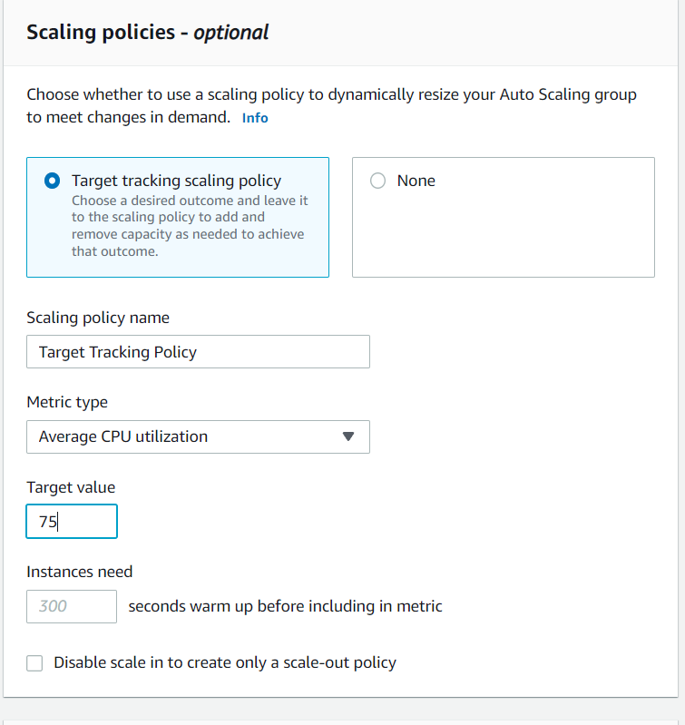
</p>

*You can check if everything it's ok by go to EC2 Dashboard*

<p align="center">
  
</p>

At this step you finish the lab