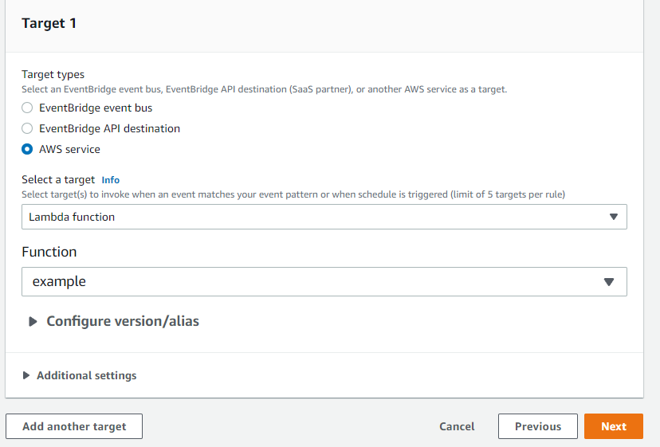

# EventBridge + Lambda + SNS Lab
This is the first lab that i got in my SOA-CO02 Exam. It's already have 2 lambda Funtion and the lab ask you to:
- Using EventBridge to run the first lamda function every 15 minutes
- Setup SNS Topic (Without Subscribe) and the Second Lambda Function it's running a new Spot Instance if one Spot Instance got terminated (You cant view the Lambda Function). And using EventBridge to trigger SNS topic

### Prepare 

*In the Exam 2 Lambda Function are already there so for simulate you have to create 2 Lambda Function on your own.*

Let's navigate to AWS Identity and Access Management (IAM) to create a role for our AWS Lambda function.
Select Role > Create Role > Select AWS service > Select Lambda and give Lambda EC2 Full Access

<p align="center">
  
</p>

Or you can create a role with the below policy.

```
{
    "Version": "2012-10-17",
    "Statement": [
        {
        "Effect": "Allow",
        "Action": [
            "logs:CreateLogGroup",
            "logs:CreateLogStream",
            "logs:PutLogEvents"
        ],
        "Resource": "arn:aws:logs:*:*:*"
        },
        {
            "Sid": "EC2FULLACCESS",
            "Effect": "Allow",
            "Action": [
                "ec2:*"
            ],
            "Resource": "*"
    ]
}
```

Next we creating 2 Lambda Function.

1. Go to lambda dashboard and click create function
2. Keep as Author from scratch and Name the function 
3. Select Runtime Python 3.X (whatever you want)
4. Permissions, use an existing role that you created before 
5. Goto code and paste: HelloWorld.py and spotHandler.py 

*For spotHandler you need one more step to make it's work*

Choose Configuration -> Environment variables ->  Edit -> Add environment variable.
<p align="center">
  
</p>

Enter a key and value so the Lamba Function can work perfectly.
1. AMI
- Key: AMI
- Value: Open EC2 in a new browser tab, click Launch Instance and copy and paste the ami value listed after Amazon Linux 2.
2. INSTANCE_TYPE
- Key: INSTANCE_TYPE
- Value: t2.micro
3. KEY_NAME
- Key: KEY_NAME
- Value: The name of the EC2 key pair you created earlier.
4. REGION
- Key: REGION
- Value: The name of the Region.
5. SUBNET_ID
- Key: SUBNET_ID
- Value: Navigate to VPC > Subnets, and copy and paste the ID of one of the public subnets in your VPC.

<ins>*To test the lambda function, Choose the function you have created. Choose Actions and Create a test events by clicking configure test events*<ins>

### Start the Lab

#### There are two requirements:
- Create a Schedule Rule that trigger Lambda Function every 15 minutes
- Create a Rule that will pulish sns notification and also trigger a Lambda Function when a Spot Instace got Terminate  

<b>First requirement:</b>

Goto EventBridge from AWS console and Click Create rule
1. Name the Rule
<p align="center">
  
</p>

2. Choose A schedule that runs at a regular rate, such as every 15 minutes. and enter the rate expression.
<p align="center">
  
</p>

3. For Target types, choose AWS service. For Select a target, choose Lambda function from the drop-down list.
<p align="center">
  
</p>

4. Click Next then you done the first requirement.

<b>Second requirement:</b>

Create an SNS topic and subscription (Since the Exam not ask you to crate a subscription so you don't have to do it)
1.    Open the Amazon SNS console.
2.    On the navigation pane, choose Topics.
3.    Choose Create topic.
4.    In the Details section, for Type, choose Standard.
5.    For Name, enter the name of your topic.
6.    Choose Create topic.
<p align="center">
  
</p>

7.    From the created topic, choose Create subscription.
8.    For Topic ARN, select the Amazon Resource Name (ARN) of the topic that you created if not automatically populated.
9.    For Protocol, enter Email.
10.    For Endpoint, enter the email address where you want to receive SNS notifications.

<p align="center">
  
</p>

You now have an SNS topic that EventBridge Events can send the EC2 Spot Interruption Notification to, let’s configure EventBridge to do so. 

Goto EventBridge from AWS console and Click Create rule
1. Name the Rule
<p align="center">
  
</p>

2. Choose rule with an Event pattern. Under Service Name select EC2 and under Event Type select EC2 Spot Instance Interruption Warning

<p align="center">
  
</p>

3. In Select targets, choose SNS target so the EventBridge can publish notification
<p align="center">
  
</p>

4. Since the Exam also ask you to use the Input Tranformer. Click Additional settings
<p align="center">
  
</p>

5. Define Input path
```
{
    "instance": "$.detail.instance",
    "state": "$.detail.state"
}
```

6. Define Template 
```
    "Instance <instance> is in <state>"
```

7. Create Additional targets for Lambda. Select a target, choose Lambda function from the drop-down list.
<p align="center">
  
</p>

8. Click Next then you done the second requirement.

*You can test by request a new spot fleet then terminate the request, then there will be a notification to your mail look like this:*
```
{"version":"0","id":"6009a9f4-cc7a-8a77-46f2-310520b31e0f","detail-type":"EC2 Spot Instance Interruption Warning","source":"aws.ec2","account":"<account-id>","time":"2019-05-27T04:52:57Z","region":"eu-west-1","resources":["arn:aws:ec2:eu-west-1b:instance/i-0481ef86f172b68d7"],"detail":{"instance-id":"i-0481ef86f172b68d7","instance-action":"terminate"}}
```