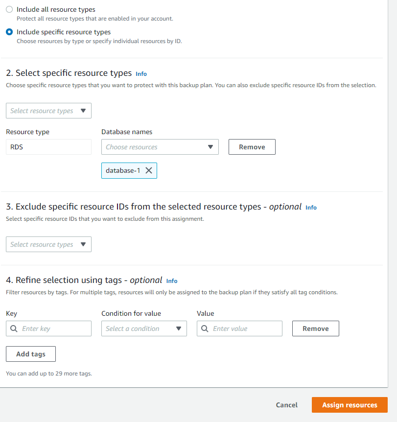

# Use AWS Backup to back up Amazon RDS Lab
This lab i take from some Posts that others Candidates Reviews about the Exam on Reddit, after pass the exam they reviews the EXAM and how hard is it. This lab ask you to use a backup plan to backup Amazon RDS resources - using a backup plan within AWS Backup for automate backups on a schedule

### Prepare
*In the Exam lab the RDS have been created but for simulate you have to create it's on your own*

1. Sign in to the AWS Management Console and open the Amazon RDS console at https://console.aws.amazon.com/rds/.

2. In the upper-right corner of the Amazon RDS console, choose the AWS Region in which you want to create the DB instance.

3. In the navigation pane, choose Databases.

4. Choose Create database. For lab only you can choose free-tier

  

### Start the Lab

#### There are two requirements:
- Configure an on-demand AWS Backup Job of an Amazon RDS database with
    - Retention Period : 1 Week
- Configure automatic AWS Backup Jobs of an Amazon RDS database 
    - Backup Frequency : Daily
    - Create a backup copy in another AWS Region (the Exam will tell you which Region, here i will select Tokyo as Destination)
- Restore of an Amazon RDS database using AWS Backup 
        
1. Log in to the AWS Management Console, and open the AWS Backup console. 

<b>First requirement:</b>

1. Log in to the AWS Management Console, and open the AWS Backup console. 

2. On the navigation pane on the left side of the AWS Backup console, under My account, choose Settings. 

3. On the Service opt-in page, choose Configure resources.

4. On the Configure resources page, Disable all services except RDS

  

5. Back in the AWS Backup console, under My account on the left navigation pane, select Protected resources.

6. From the dashboard, select the Create on-demand backup button.

  

7. On the Create on-demand backup page, choose the resource type rds and select the rds that have been create 

  

8. Choosing Create new Backup vault opens a new page to create a vault

  

9. Select the Create on-demand backup button

<b>Second requirement:</b>

1. In the AWS Backup console, select Backup plans on the left navigtation pane under My account, and then Create Backup plan.

2. Input Backup plan name and select Build a new plan 

  

3. Input Rule Name and set Backup Frequency to Daily and Retetion period in 1 month 

  

4. In Destination Region Select the Region that Exam Mention and select Backup Vault (Already create in EXAM)

  

5. For assign resources to the backup plan select the created backup plan, and select the Assign Resources button.

  

6. Input Resource Assignment Name and select Default Role 

  

7. select Resource ID and select the Database

  

8. Select Assign Resources and the backup plan has the resources assigned to it.

9. Navigate to the AWS Backup console and the backup jobs will be seen under Jobs. 

<b>Third requirement:</b>

1. For Restore RDS Backup, Navigate to the backup vault that was selected in the backup plan and select the latest completed backup. To restore the database, click on the recovery point ARN and select Restore. 

2. Select all the parameter that EXAM lab metion (here i pick cheapest one for simulate)

  

3. Restore role - Select the Default role.

4. Select Restore backup.

At this step you finish the lab

*Once the restore job is completed, you can navigate to the Amazon RDS console and use the endpoint to connect to the database.*