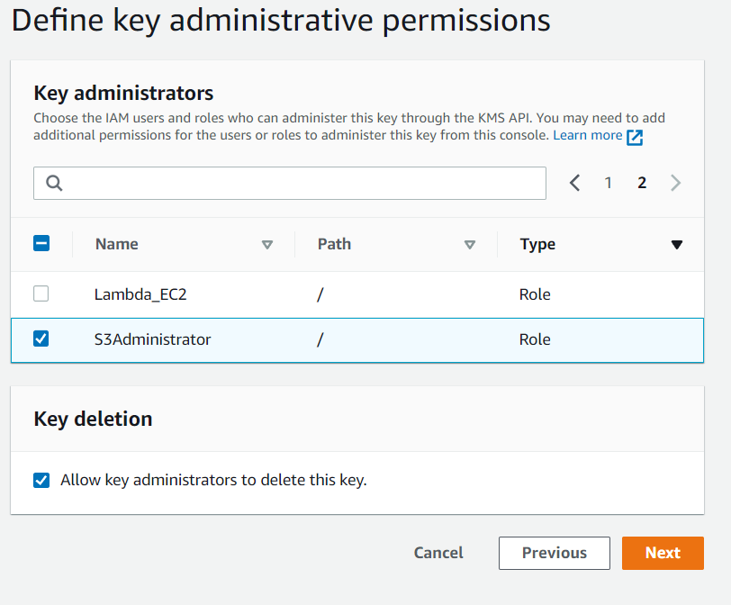

# S3 with Default Encryption and Monitoring Access Logs Lab
This lab i take from some Posts that others Candidates Reviews about the Exam on Reddit, after pass the exam they reviews the EXAM and how hard is it. This lab access you to create 2 buckets, one with bucket encryptions and logging access to another bucket

### Prepare
*In the Exam lab the IAM Role, Custom Policy and a KMS Key already created so you dont have to create it but for simulate you have to create it's on your own*

1. Sign in to the AWS Management Console and open the IAM console at https://console.aws.amazon.com/iam/

2. In the navigation pane of the console, choose Roles and then choose Create role.

3. Choose AWS account role type.

<p align="center">
  
</p>

4. Select the policy to use for the permissions policy: AWSKeyManagementServicePowerUser for Full Access on KMS 

<p align="center">
  
</p>


<p align="center">
  
</p>

<p align="center">
  
</p>

### Start the Lab

#### There are three requirements:


```
{
    "Version": "2012-10-17",
    "Statement": [
        {
            "Sid": "VisualEditor0",
            "Effect": "Allow",
            "Action": [
                "kms:Encrypt",
                "kms:Decrypt"
            ],
            "Resource": "*"
        }
    ]
}
```

1 hours 