# S3 with Default Encryption and Monitoring Access Logs Lab
This lab i take from some Posts that others Candidates Reviews about the Exam on Reddit, after pass the exam they reviews the EXAM and how hard is it. This lab access you to create 2 buckets, one with bucket encryptions and logging access to another bucket

### Prepare
*In the Exam lab the IAM Role, Custom Policy and a KMS Key already created so you dont have to create it but for simulate you have to create it's on your own*

1. Sign in to the AWS Management Console and open the IAM console at https://console.aws.amazon.com/iam/

2. In the navigation pane of the console, choose Roles and then choose Create role.

3. Choose AWS account role type.

<p align="center">
  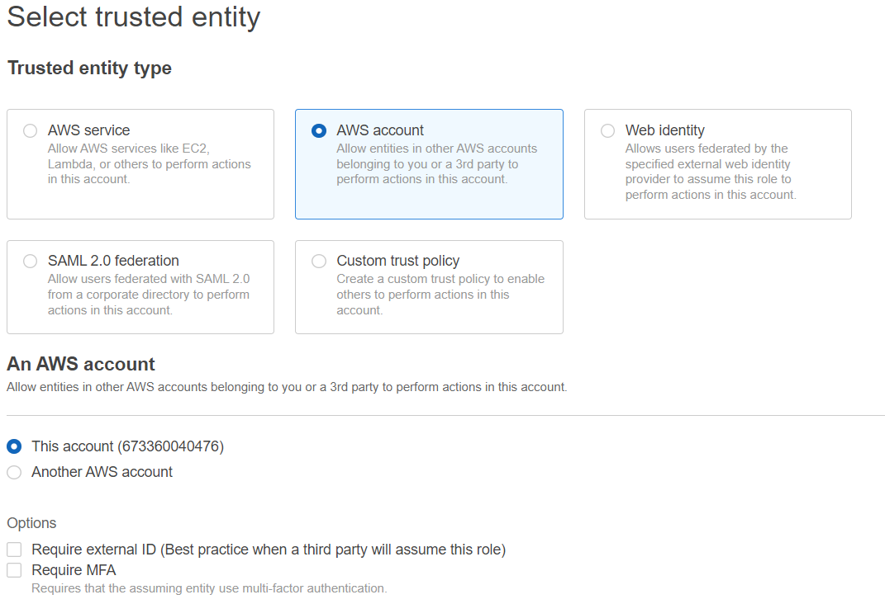
</p>

4. Select the policy to use for the permissions policy: AWSKeyManagementServicePowerUser for Full Access on KMS 

<p align="center">
  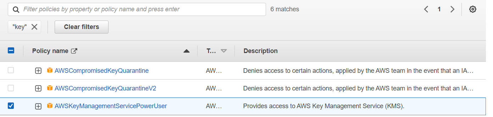
</p>

5. For Role name, enter a name for your role. Role names must be unique within your AWS account

<p align="center">
  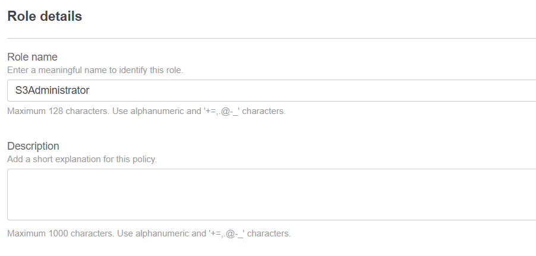
</p>

6. In the navigation pane of the IAM console, choose Roles, and then choose Create role.

7. For Select trusted entity, choose AWS service.

8. For use case choose S3

<p align="center">
  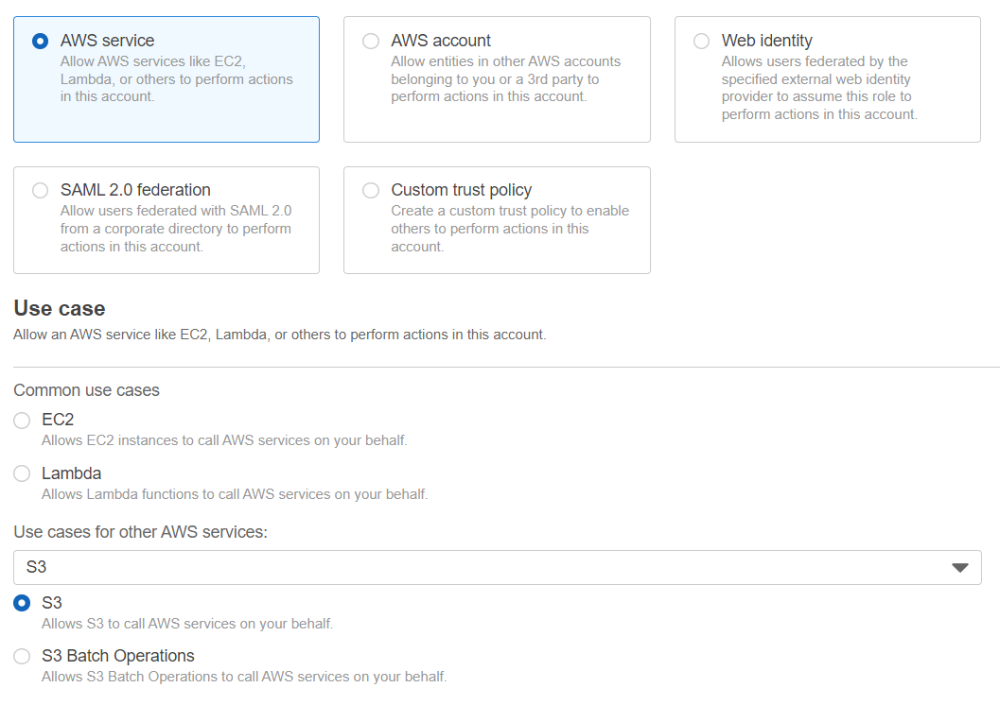
</p>

9. Create a new policy from scratch by following:
```
{
    "Version": "2012-10-17",
    "Statement": [
        {
            "Sid": "VisualEditor0",
            "Effect": "Allow",
            "Action": [
                "kms:Encrypt",
                "kms:Decrypt"
            ],
            "Resource": "*"
        }
    ]
}
```

10. Enter Role Name and you done the preparation phase

### Start the Lab

#### There are two requirements:
- Create 2 buckets (block all public access):
  - First bucket with:
    - Default encryption with symmetric customer managed key
    - Enable Access logging 
  - Second bucket for store Access Logs

<b>First requirement:</b>

1. Creating symmetric KMS keys by sign in to the AWS Management Console and open the AWS Key Management Service (AWS KMS) console at https://console.aws.amazon.com/kms.

2. In the navigation pane, choose Customer managed keys.

3. Choose Create key.

4. To create a symmetric KMS key, for Key type choose Symmetric.

<p align="center">
  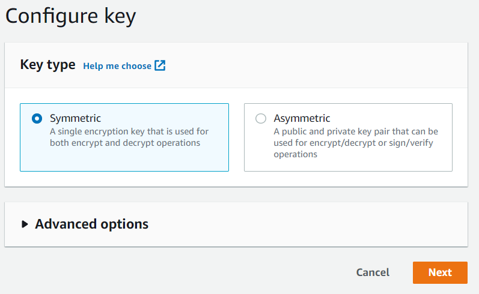
</p>

5. Type an alias for the KMS key. The alias name cannot begin with aws/. The aws/ prefix is reserved by Amazon Web Services to represent AWS managed keys in your account. (The Exam will give you a name for the key)

6. Select the IAM users and roles that can administer the KMS key (The Exam will define which IAM user and all you have to do it's selecte)

<p align="center">
  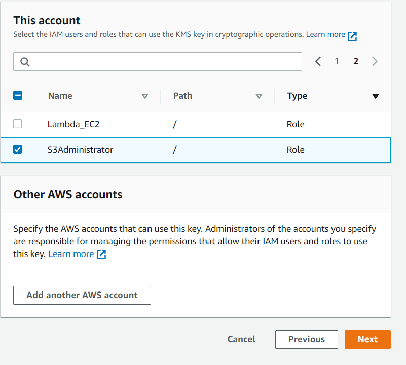
</p>

7. Select the IAM users and roles that can use the key in cryptographic operations(The Exam will define which IAM role and all you have to do it's selecte)

<p align="center">
  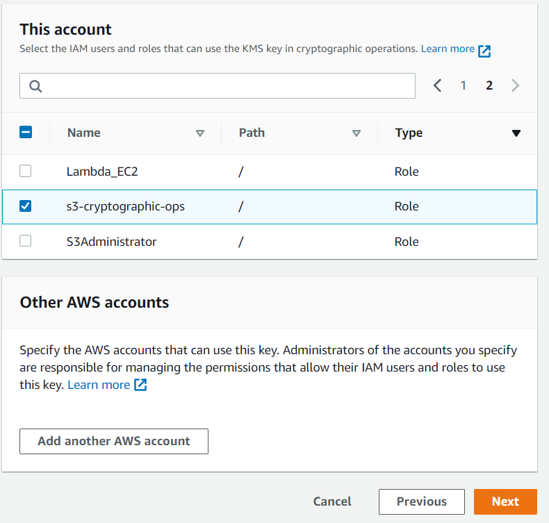
</p>

8. Choose Finish to create the KMS key.

<p align="center">
  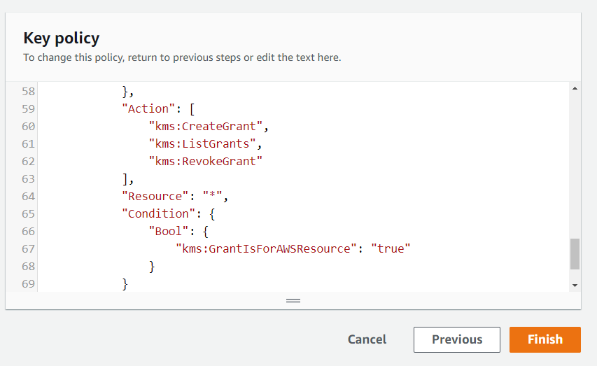
</p>

9. Create 2 buckets by open the Amazon S3 console at https://console.aws.amazon.com/s3/

10. Choose Create bucket.

11. Enter the bucket name that EXAM give you

<p align="center">
  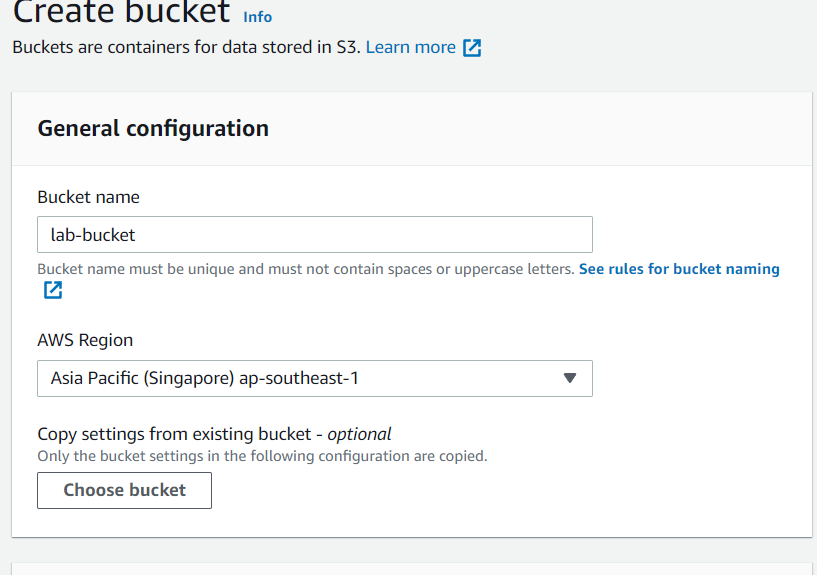
</p>

12. In Bucket settings for Block Public Access, choose the Block Public Access settings that you want to apply to the bucket.

<p align="center">
  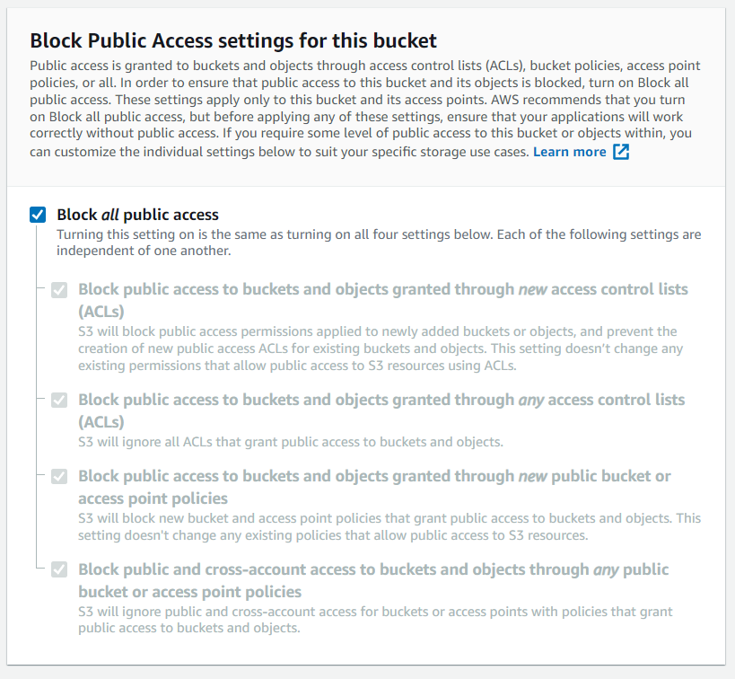
</p>

13. To enable or server-side encryption, choose Enable. Under Encryption key type, choose AWS Key Management Service key (SSE-KMS). Under AWS KMS key choose Choose from your KMS root keys, and choose the symmetric KMS that you just create.

<p align="center">
  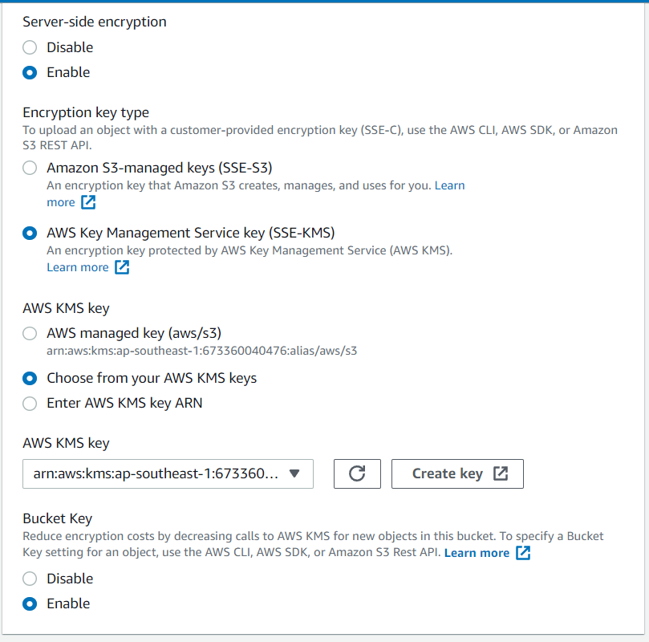
</p>

14. Creating another bucket with the name that EXAM give you same as first bucket but without default bucket encryption.

<p align="center">
  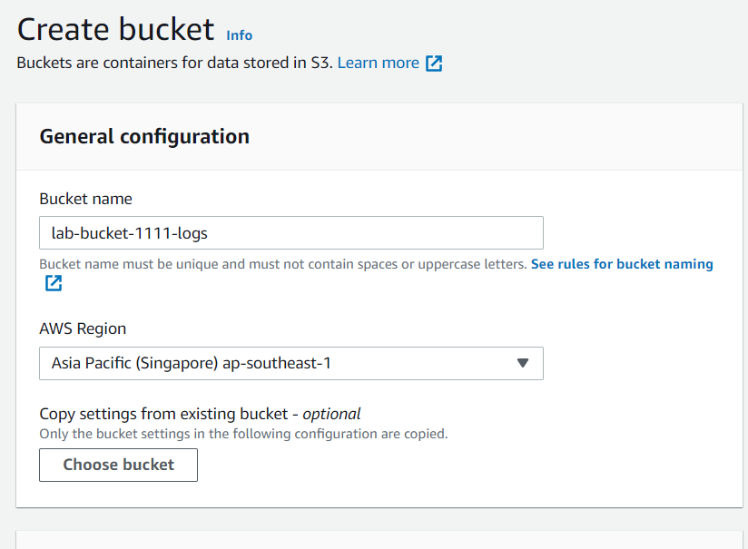
</p>

<b>Second requirement:</b>

1. In the Buckets list, choose the name of the first bucket that you want to enable server access logging for.

2. Choose Properties.

3. In the Server access logging section, choose Edit.

4. Under Server access logging, select Enable.

5. For Target bucket, enter the name of the second bucket.

<p align="center">
  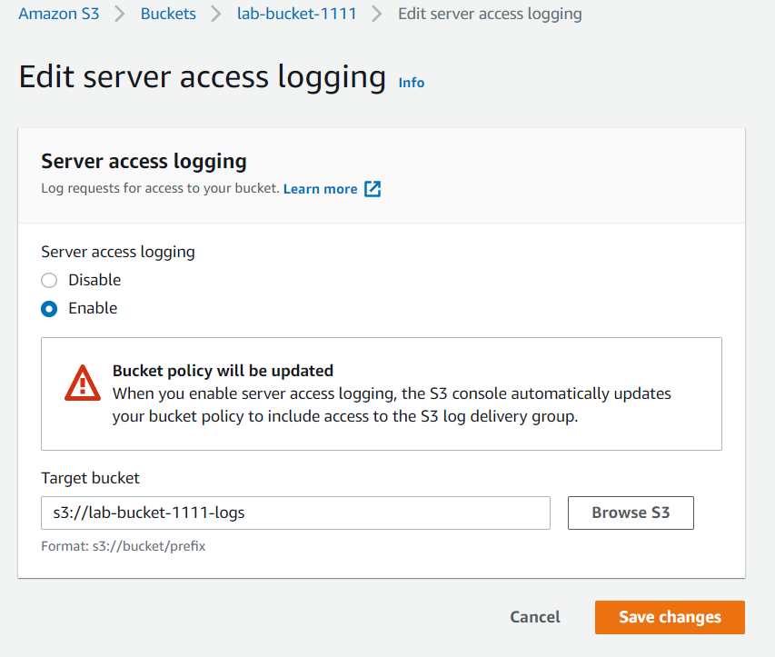
</p>

6. Choose Save changes and you done the Lab.

*for testing you have to wait for a hour so the access logs can be deliver to the second bucket, and it's will look like this*

<p align="center">
  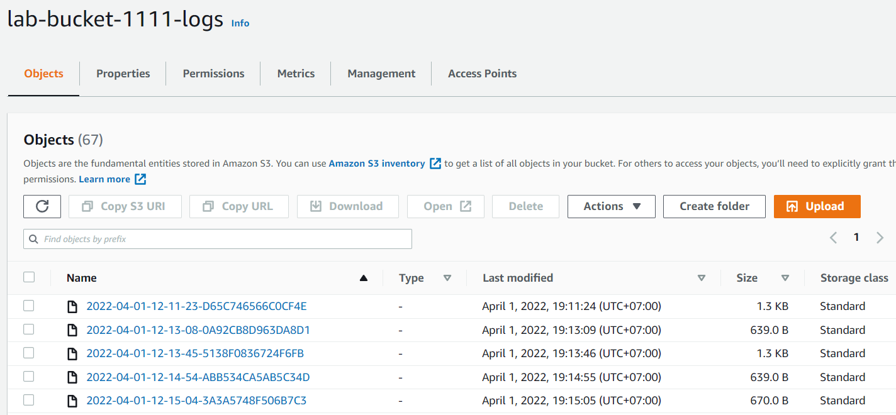
</p>