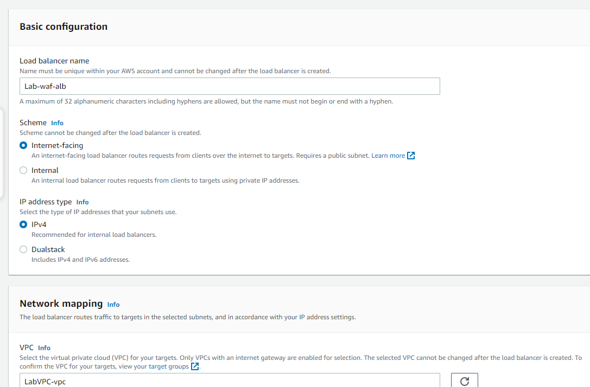
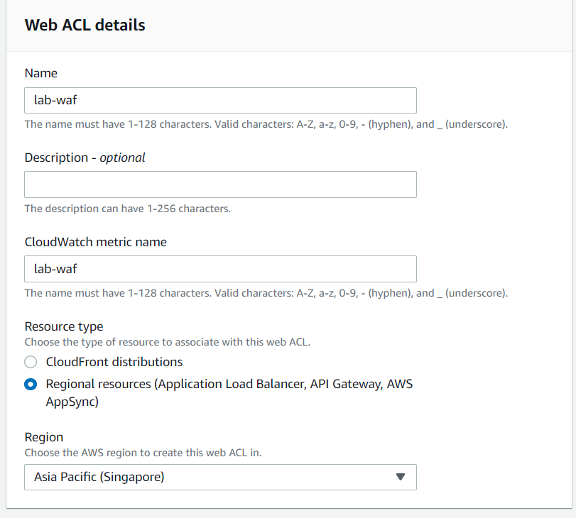
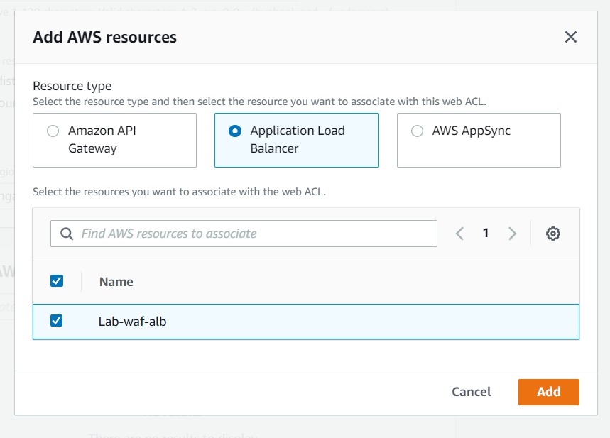
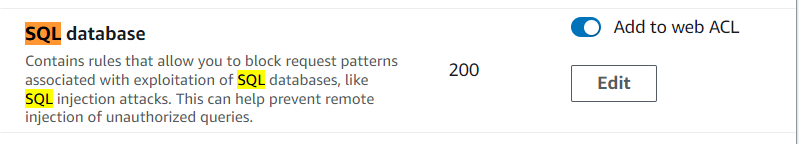
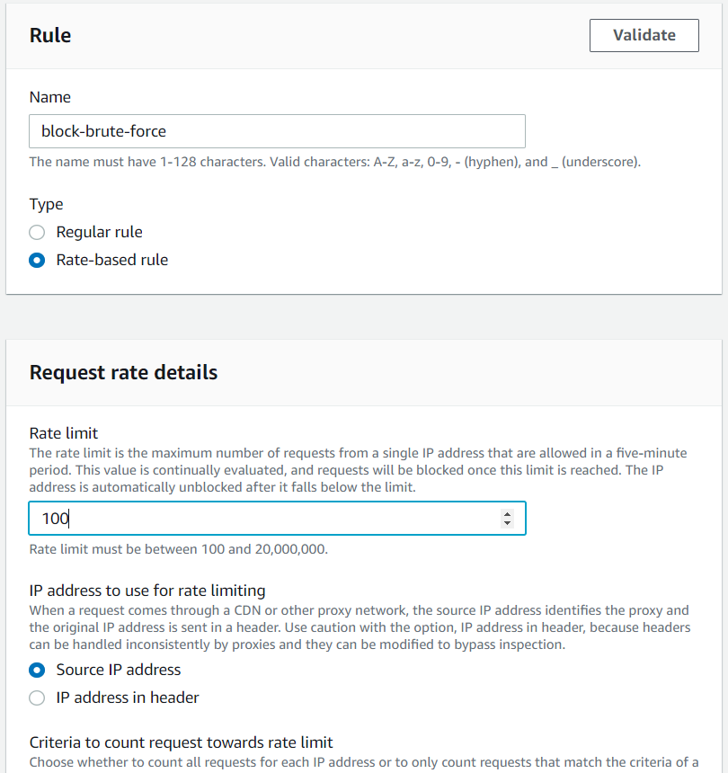
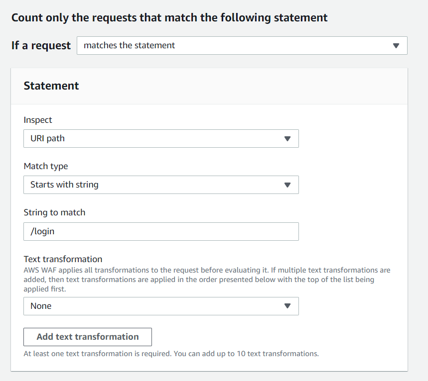
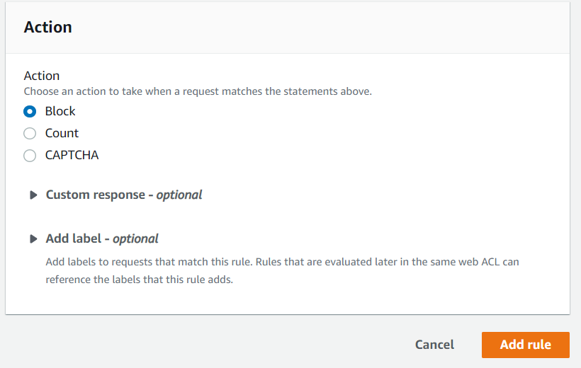
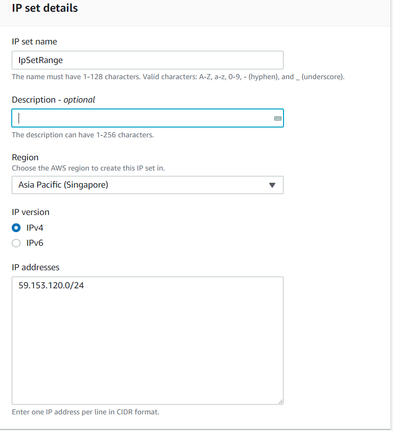
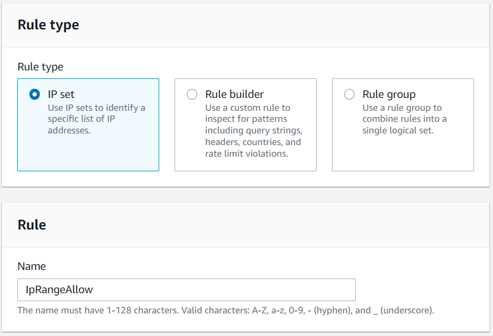
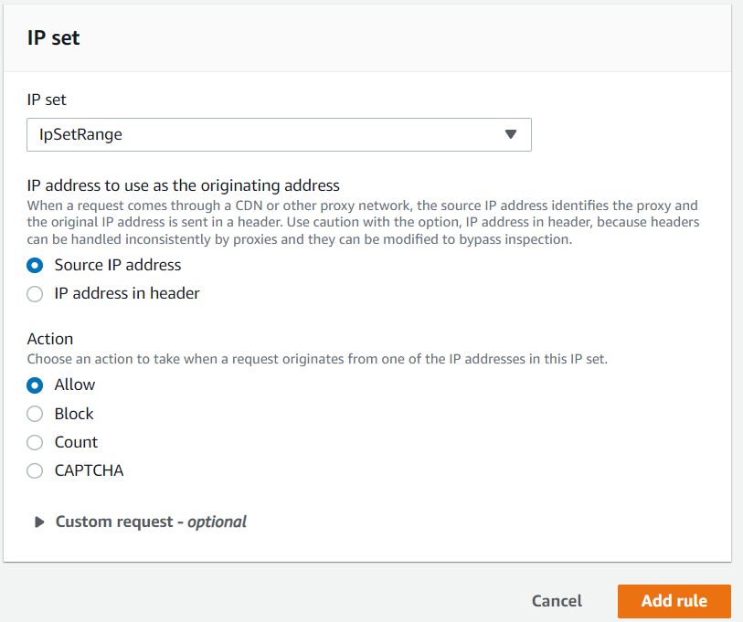

# Waf Configuraion Lab
This is the last one lab that i got in my EXAM. The lab ask you to configure some WAF rules and associated with ALB that have been created.

### Prepare 
*In the Exam lab the ALB already there so you dont have to create it but for simulate you have to create it's on your own*

1. Open the Amazon EC2 console at https://console.aws.amazon.com/ec2/.

2. In the navigation pane, under Load Balancing, choose Load Balancers. Choose Application Load Balancer

3. For Load balancer name, enter a name for your load balancer.For Scheme, choose Internet-facing

  

4. For Security groups, select an existing security group. For Listeners and routing, the default listener accepts HTTP traffic on port 80 and forward to existed Target group that you create before

### Start the Lab

#### There are three requirements:
- Create 1 AWS Managed Rules
- 2 Custom Rules
    - Block Brute-force Attack : Block IP if send 100 request in 5 minutes to URi path: /login
    - Only allow a Set of Defined IP 

<b>First requirement:</b>

1. From the AWS WAF home page, choose Create web ACL.

2. For Name, enter the name that you want to use to identify this web ACL same as for CloudWatch metric name. For Resource type choose *Regional resources*

  

3. For Associated AWS resources - optional, choose Add AWS resources. Resource type choose Application Load Balancer and select the ALB that already created.

  

4. On the Add rules and rule groups page, choose Add rules, and then choose Add managed rule groups.

5. On the Add managed rule groups page, expand the listing for the AWS managed rule groups and find SQL Database and enable it

  

<b>Second requirement:</b>

1. On the Add rules and rule groups page, choose Add rules, and then choose Add my own rules and rule groups

2. Name the rules and choose Rule Builder. For type choose rate-based rule and set the value 100

  

3. In Criteria to count request towards rate limit select *Only consider requests that match the criteria in a rule statement.* 
    - If a request: matches the statement
    - Inspec: URi path
    - String to math: /login

  

4. For action choose Block and Add Rule

  

<b>Third requirement:</b>

1. In the navigation pane, choose IP sets and then Create IP set.

2. Enter a name and description for the IP set. 

3. For Region, choose the Region where you want to store the IP set 

4. In the IP addresses text box, enter one IP address or IP address range per line, in CIDR notation. In put the IPv4 address (Since i don't remmember so i will pick random)

  

5. On the Add rules and rule groups page , choose Add rules, and then choose Add my own rules and rule groups

6. Name the rules and choose IP set. 

  

7. Select the IP set that already create. For action choose Allow 

  

8. In Amazon CloudWatch metrics disable monitoring for IP Set Rules

At this step you finish the lab